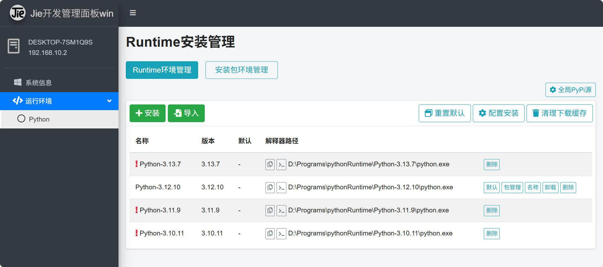

# Jieadminpanel-for-win

#### 介绍
用python + django开发，用于管理windows开发环境的工具，目前的功能是进行python的环境部署

哔哩哔哩主页:  IT阿杰  https://space.bilibili.com/379283376   
Gitee主页： https://gitee.com/itjiedev    
Github主页： https://github.com/itjiedev  

#### 软件架构
使用python Django框架开发,原生模板，内嵌python，安装环境不会染污系统本身的环境。

#### 安装教程

1.  下载压缩包解压到非特殊字符和中文字符的文件夹里（直接克隆库也可以），建议放到非C盘的文件夹，只有一个盘建议放到文档文件或者 %LOCALAPPDATA% 中防止出现权限问题。
2. 第一次双击安装运行setup.bat脚本，等待bat脚本运行完毕，关闭脚本终端窗口。
3. 安装完成后桌面会出现二个图标，先双击 RunJieAdminPanel 启动，然后点击 JieAdminPanel 打开浏览器运行
4. 根据浏览器界面提示操作即可。

特别提醒：建议在发行版中下载提供的zip压缩包，勿直接使用平台的zip下载功能，易造成bat文件运行失败。

#### 如何升级
如果执行终端窗口正在运行，如果程序正在运行先关闭，解压压缩包，使用压缩包里的文件夹替换安装目录里的文件夹即可。例如：
如果需要运行脚本或者其他操作，压缩包会附带升级说明，参考升级说明操作。

#### 授权说明
仅用于个人学习交流，请勿用于商业用途，因使用造成的损失，不承担任何责任。  

